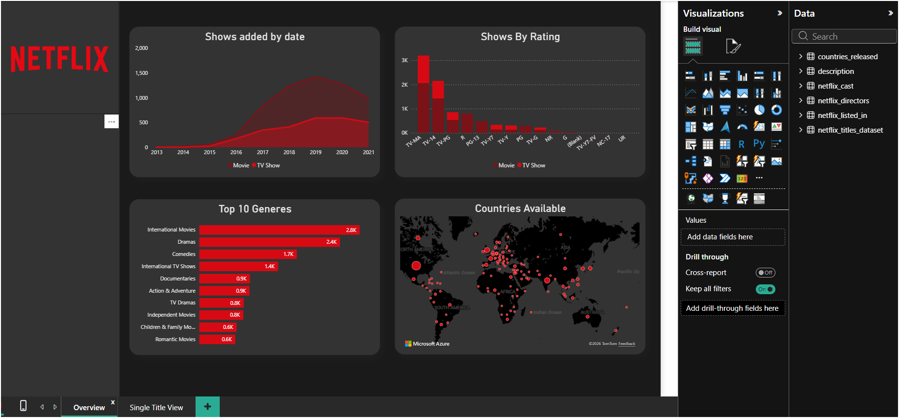
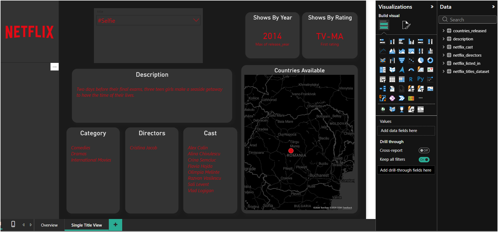

# Netflix Data Analysis Dashboard
# Netflix Data Analysis Dashboard

## Overview
This project analyzes the Netflix dataset using MySQL and Power BI to uncover content trends and business insights through interactive dashboards.
## Overview
This project analyzes the Netflix dataset using MySQL and Power BI to uncover content trends and business insights through interactive dashboards.

## Tools & Technologies
- Power BI
- MySQL
- SQL
- Excel
- DAX

## Project Features
- Cleaned and transformed raw Netflix dataset.
- Imported data from MySQL into Power BI.
- Created interactive dashboards with slicers, KPI cards, and charts.
- Built DAX measures for business analysis.
- Analyzed content by genre, release year, rating, and country.

## Dashboard Preview

### Dashboard 1

### Dashboard 2

## Repository Contents
- Power BI Dashboard (.pbix)
- SQL Scripts
- Excel Dataset
- Dashboard Screenshots
